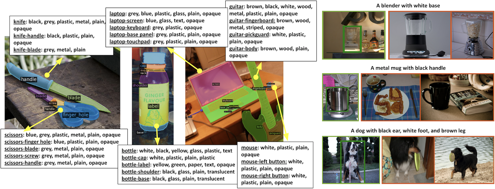

# PACO: Parts and Attributes of Common Objects



PACO is a detection dataset that goes beyond traditional object boxes and masks and provides richer annotations such as part masks and attributes. It spans 75 object categories, 456 object-part categories and 55 attributes across image (LVIS) and video (Ego4D) datasets. We provide 641K part masks annotated across 260K object boxes, with roughly half of them exhaustively annotated with attributes as well. We design evaluation metrics and provide benchmark results for three tasks on the datasets: part mask segmentation, object and part attribute prediction and zero-shot instance detection. See the paper and [dataset doc](docs/PACO_DATASET.md) for more details.

This repository contains data loaders, training and evaluation scripts for joint object-part-attributes detection models, query evaluation scripts, and visualization notebooks for PACO dataset.

[[Paper](https://arxiv.org/abs/2301.01795)][[Website](https://paco.metademolab.com)]

## Setup

### Library Setup

To setup the library run:
```
git clone git@github.com:facebookresearch/paco.git
cd paco/
conda create --name paco python=3.9
conda activate paco
pip install torch==1.10.2+cu113 torchvision==0.11.3+cu113 -f https://download.pytorch.org/whl/torch_stable.html
pip install -r requirements.txt
pip install -e .
```

Test whether the setup was succesful:
```
(paco) ~/paco$ python
Python 3.9.15 (main, Nov 24 2022, 14:31:59)
[GCC 11.2.0] :: Anaconda, Inc. on linux
Type "help", "copyright", "credits" or "license" for more information.
>>> import paco
>>>
```

### Dataset setup
To train and evaluate on PACO dataset using this repo, please download the train2017 and val2017 COCO images (PACO-LVIS uses them), PACO annotations, and PACO-EGO4D frames. Then setup the following environment variables:
```
conda env config vars set PACO_ANNOTATION_ROOT=/path/to/paco/annotations
conda env config vars set PACO_IMAGES_ROOT=/path/to/paco/images
conda env config vars set COCO_IMAGES_ROOT=/path/to/coco/images
conda activate paco
```

To download PACO annotations:
```
cd /path/to/paco/annotations
wget https://dl.fbaipublicfiles.com/paco/annotations/paco_lvis_v1.zip
wget https://dl.fbaipublicfiles.com/paco/annotations/paco_ego4d_v1.zip
diff <(sha256sum paco_ego4d_v1.zip) <(echo "9a2de524dd64ad8f807f0d1ad2e96de590b9fb222e55192ccfdd7b7b09b89252  paco_ego4d_v1.zip")
diff <(sha256sum paco_lvis_v1.zip) <(echo "02ac4edb22c251e07853e6231d69aec3fad0a180f03de2f8c880650322debc80  paco_lvis_v1.zip")
```
and if SHA-256 checksum matches
```
unzip paco_lvis_v1.zip
unzip paco_ego4d_v1.zip
```

To download PACO-EGO4D frames:

1. Review and accept the terms of Ego4D usage agreement ([Ego4D Dataset](https://ego4ddataset.com)). It takes 48 hours to obtain credentials needed for frame download.
2. Download the frames
```
ego4d --output_directory /temp/folder --version v1 --datasets paco_frames
mv /temp/folder/v1/paco_frames /path/to/paco/images
```

## Usage

### Pre-trained models

For links to pre-trained models and corresponding performance see our [model zoo](docs/MODEL_ZOO.md). The evaluation commands in the next section will assume that the models are downloaded into `./models` folder in the paco repo root.

### **Example commands**

#### **Training**

To train an R101 FPN model on joint PACO dataset on a single node with 8 GPUs, run
```
./tools/lazyconfig_train_net.py --config-file ./configs/mask_rcnn_configs/r101_attr_fpn_100_ep.py --num-gpus 8
```
To train the same model on PACO-LVIS only, run
```
./tools/lazyconfig_train_net.py --config-file ./configs/mask_rcnn_configs/r101_attr_fpn_100_ep.py --num-gpus 8 dataloader.train.dataset.names=paco_lvis_v1_train
```
To train the same model on 8 nodes with 8 GPUs with 32GB RAM in SLURM, run
```
python3 ./tools/multi_node_training.py \
    --config-file ./configs/mask_rcnn_configs/r101_attr_fpn_100_ep.py \
    --num-gpus 8 \
    --num-machines 8 \
    --use-volta32 \
    --name "r101_100_ep" \
    --target "./tools/lazyconfig_train_net.py" \
    --job-dir "./output/r101_100_ep/"
```

#### **Eval**

To evaluate a pre-trained ViT-L FPN model on PACO-EGO4D on a single node with 8 GPUs, run
```
./tools/lazyconfig_train_net.py --config-file ./configs/mask_rcnn_configs/vit_b_fpn_100_ep.py --eval-only --num-gpus 8 train.init_checkpoint=./models/vit_l_fpn_joint.pth dataloader.test.dataset.names=paco_ego4d_v1_test
```

#### **Query eval**

To evaluate a pre-trained ViT-L FPN model on PACO-EGO4D query dataset on a single node with 8 GPUs, run
```
./tools/lazyconfig_train_net.py --config-file ./configs/query_eval_configs/vit_l_fpn_query_eval.py --eval-only --num-gpus 8 train.init_checkpoint=./models/vit_l_fpn_joint.pth dataloader.test.dataset.names=paco_ego4d_v1_test
```

## Citation

```
@inproceedings{ramanathan2023paco,
  title={{PACO}: Parts and Attributes of Common Objects},
  author={Ramanathan, Vignesh and Kalia, Anmol and Petrovic, Vladan and Wen, Yi and Zheng, Baixue and Guo, Baishan and Wang, Rui and Marquez, Aaron and Kovvuri, Rama and Kadian, Abhishek and Mousavi, Amir and Song, Yiwen and Dubey, Abhimanyu and Mahajan, Dhruv},
  booktitle={arXiv preprint arXiv:2301.01795},
  year={2023}}
}
```

## License
Copyright (c) Meta Platforms, Inc. and affiliates.

This source code is licensed under the license found in the
LICENSE file in the root directory of this source tree.
