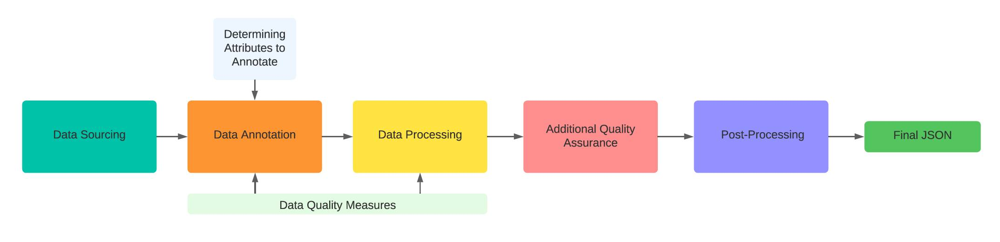
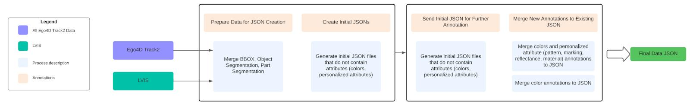

# PACO (Parts and Attributes for Common Objects) Dataset


## Dataset Overview
PACO is based on two datasets: LVIS (image) and Ego4D (video). We sourced images from these datasets, and created additional annotations to get the final dataset. Annotations were done through Meta's internal platform Halo. The external vendors annotate the objects and parts according to our annotations guidelines. For this release, we're only focusing on 75 object classes (see below for the full list of the classes).

### PACO-LVIS

| Stats      | train/val/test |
| :---        |    :----:   |
| number of images      | 45790/2410/9443       |
| number of images with annotations   | 45790/2410/9443        |
| number of bounding boxes   | 217117/10794/45861        |
| number of object segments   | 217117/10794/45861        |
| number of part segments   | 395071/20945/86041        |
| number of bboxes with obj attributes   | 58846/3140/12407        |
| number of bboxes with part attributes   | 52088/2812/11003        |

### PACO-EGO4D
| Stats      | train/val/test |
| :---        |    :----:   |
| number of images      | 15667/825/9892       |
| number of images with annotations   | 15667/825/9892        |
| number of bounding boxes   | 34835/1816/21708        |
| number of object segments   | 29462/1522/19565        |
| number of part segments   | 81528/4240/53580        |
| number of bboxes with obj attributes   | 30556/1599/17423        |
| number of bboxes with part attributes   | 26343/1359/15211        |


## Dataset Format
PACO-LVIS and PACO-EGO4D are provided in the standard COCO JSON format, following the structure below:

``` python
# data: the variable we're loading and saving json dictionary to

data["images"]: # a list of dictionaries, each dictionary corresponds to one image
{
    'id':                                   int,
    'file_name':                            str,
    'width':                                int,
    'height':                               int,
    'neg_category_ids':                     list,
    'not_exhaustive_category_ids':          list,
    'neg_category_ids_attrs':               list,
    'not_exhaustive_category_ids_attrs':    list,
    'license':                              int,
}
data["annotations"]: # a list of dictionaries, each dictionary corresponds to one object or part bounding box
{
    'id':                       int,
    'bbox':                     [x,y,width,height],
    'area':                     float,
    'category_id':              int,
    'image_id':                 int,
    'segmentation':             RLE,
    'attribute_ids':            List[int],
    'dom_color_ids':            List[int],
    'obj_ann_id':               int,
    'unknown_color':            0 or 1,
    'unknown_pattern_marking':  0 or 1,
    'unknown_material':         0 or 1,
    'unknown_transparency':     0 or 1,
    'instance_id':              int,    # PACO-EGO4D only
    'blur_level':               int,    # PACO-EGO4D only
}
data["categories"]: # a list of dictionaries, each dictionary corresponds to one object category
{
    'supercategory':    'OBJECT',
    'id':               int,
    'name':             str,
    'image_count':      int,
    'instance_count':   int,
    'synset':           str,
    'frequency':        char,
}
data["part_categories"]: # a list of dictionaries, each dictionary corresponds to one part category
{
    'supercategory': 'PART',
    'id':            int,
    'name':          str
}
data['attributes']: # a list of dictionaries, each dictionary corresponds to one attribute category
{
    'supercategory': 'ATTR',
    'id':            int,
    'name':          str
}
data["attr_type_to_attr_idxs"]: # dictionary, key is the attribute name (one of: color, pattern, marking, material, transparency, value is the list of ids each attribute corresponds to)
{
    'color':            range(30),
    'pattern_marking':  range(30,41),
    'material':         range(41,55),
    'transparency':     range(55,59)
}
```


## Object, Part, and Attribute Classes
### 75 Object Classes
``` python
['trash_can','handbag','ball','basket','bicycle','book','bottle','bowl','can','car_(automobile)','carton','cellular_telephone','chair','cup','dog','drill','drum_(musical_instrument)','glass_(drink_container)','guitar','hat','helmet','jar','knife','laptop_computer','mug','pan_(for_cooking)','plate','remote_control','scissors','shoe','slipper_(footwear)','stool','table','towel','wallet','watch','wrench','belt','bench','blender','box','broom','bucket','calculator','clock','crate','earphone','fan','hammer','kettle','ladder','lamp','microwave_oven','mirror','mouse_(computer_equipment)','napkin','newspaper','pen','pencil','pillow','pipe','pliers','plastic_bag','scarf','screwdriver','soap','sponge','spoon','sweater','tape_(sticky_cloth_or_paper)','telephone','television_set','tissue_paper','tray','vase']
```

### 200 Part Categories
``` python
['antenna','apron','arm','back','back_cover','backstay','bar','barrel','base','base_panel','basket','bezel','blade','body','border','bottom','bowl','bracket','bridge','brush','brush_cap','buckle','bulb','bumper','button','cable','camera','canopy','cap','capsule','case','clip','closure','colied_tube','control_panel','cover','cuff','cup','decoration','dial','door_handle','down_tube','drawer','drawing','ear','ear_pads','embroidery','end_tip','eraser','eye','eyelet','face','face_shield','fan_box','fender','ferrule','finger_hole','fingerboard','finial','flap','food_cup','foot','footrest','fork','frame','fringes','gear','grille','grip','hand','handle','handlebar','head','head_tube','headband','headlight','headstock','heel','hem','hole','hood','housing','inner_body','inner_side','inner_wall','insole','jaw','joint','key','keyboard','label','lace','lead','left_button','leg','lid','light','lining','logo','loop','lower_bristles','lug','mirror','motor','mouth','neck','neckband','nose','nozzle','nozzle_stem','outer_side','outsole','page','pedal','pedestal_column','pediment','pickguard','pipe','pom_pom','prong','pull_tab','punt','push_pull_cap','quarter','rail','right_button','rim','ring','rod','roll','roof','rough_surface','runningboard','saddle','screen','screw','scroll_wheel','seal_ring','seat','seat_stay','seat_tube','shade','shade_cap','shade_inner_side','shaft','shank','shelf','shoulder','side','side_button','sign','sipper','skirt','sleeve','slider','spindle','splashboard','spout','steeringwheel','stem','step','sticker','stile','strap','stretcher','string','switch','swivel','table_top','tail','taillight','tank','tapering_top','teeth','terry_bar','text','throat','time_display','tip','toe_box','tongue','top','top_cap','top_tube','touchpad','trunk','turnsignal','turntable','vamp','vapour_cover','visor','welt','wheel','window','windowpane','windshield','wiper','wire','yoke','zip']
```

### 55 Attribute + 4 Background Categories
``` python
['black', 'light_blue', 'blue', 'dark_blue', 'light_brown', 'brown', 'dark_brown', 'light_green', 'green', 'dark_green', 'light_grey', 'grey', 'dark_grey', 'light_orange', 'orange', 'dark_orange', 'light_pink', 'pink', 'dark_pink', 'light_purple', 'purple', 'dark_purple', 'light_red', 'red', 'dark_red', 'white', 'light_yellow', 'yellow', 'dark_yellow', 'other(color)', 'plain', 'striped', 'dotted', 'checkered', 'woven', 'studded', 'perforated', 'floral', 'other(pattern_marking)', 'logo', 'text', 'stone', 'wood', 'rattan', 'fabric', 'crochet', 'wool', 'leather', 'velvet', 'metal', 'paper', 'plastic', 'glass', 'ceramic', 'other(material)', 'opaque', 'translucent', 'transparent', 'other(transparency)']
```


## Visualization
`location: 
"notebook/Visualize PACO dataset images.ipynb";
"notebook/Visualize PACO dataset objects.ipynb";
"notebook/Visualize PACO queries.ipynb"
"notebook/Visualize PACO-EGO4D instances.ipynb"`

The notebooks provide visualizations for the JSON dataset. For all four notebooks, you can follow the below steps to visualize:
    
    1. Specify the dataset name in the first cell and run the load dataset and visualize function cells.
    2. Tune the parameters under "Visualize" and run the code cell to visualize the data
    
    Use "Visualize PACO dataset objects.ipynb" as an example:
        - vis_num_samples: number of samples to visualize and show in the output
        - vis_offset: the offset from which we want to start counting for vis_num_samples
        - vis_cat: the class we want to visualize on (optional, value: None or class_name)
        - vis_attr: the attribute we want to visualize on (optional, value: None or attr_name)
        - Example: vis_num_samples = 5, vis_offset = 10, vis_cat = 'bicycle', vis_color = 'red' --> The output will show:
            a) A line printing: Number of boxes with a red bicycle: 45 (this gives 0-44 indices)
            b) 5 instances of red bicycles (index 10-14), with all parts visualized in the same row
            c) Other detailed information: obj_name, bbox, obj_attrs, part_attrs, image_id, ann_id
    
    The steps work similarly for other visualization notebooks. All of the parameters to be used under "Visualize" cell have detailed annotations next to them.


## Data Quality Assurance
We adopted multiple QA measures during the data annotation, post-annotation audit, and data processing phases.

### Data Annotation
Attributes data are multi-reviewed and adopting a "majority vote policy" to ensure most accurate result. Annotators are also trained to strictly follow detailed annotation guidelines, where both positive and negative examples of instances are shown.

Additionally, we track the quality of data annotations in our internal Halo dashboard through common metrics like IOU precision/recall for bounding box tasks and accuracy for classification tasks. There are metrics that are visualized like queue progress, positive hit rate (number of images correctly classified) for a given object across multiple countries, etc. These metrics are calculated on gold standard data that raters have annotated.

### Post Annotation Audit
We took the below QA measures to fix incorrect annotations:
1. Ensuring all responses have object-level annotations
2. Ensuring no mismatch between annotated parts and listed parts (ex: parts 0 and 3 are listed but only parts 0 and 1 are annotated by rater)
3. Ensuring no “half-annotated” responses (ex: If pattern, material, and reflectance are annotated for part 0 but marking is missing)
4. Ensuring object/part proper alignment (ex: if object-level colors contain black but no parts are annotated as black
5. Manual inspection of recently annotated responses (incorrect attributes selected, insignificant/small attributes selected, wrongly rejected jobs, etc)
6. Quality checks on final JSON: Visualize grids of boxes marked with a selected attribute, marking incorrect ones, and returning to audit queues

### Data Processing
In our annotation extraction (from Halo) pipeline, we implemented basic validations to check for abnomralities (i.e. 1 to 1 mapping for bbox vs. object mask, null values in payload and empty payloads, etc.). During merging of the object, part, and attribute annotation data, we designed additional checks (i.e. checksum on source and destinations) to make sure we're not dropping any data during processing. After annotations are processed into JSON, we calculated statistics and matched the numbers of annotations in JSON with total sent for annotations. Furthermore, we visualized and mapped the annotation back to Halo to ensure accuracy and consistency.


# JSON Data Formation
## Overall Flow


## Data Sources
### Ego4D
We used three types of Ego4D track2 annotation data (Narrations, Visual Crop, Response Track) from two categories: a) Narrations b) Visual Object Queries (Episodic Memory). Details about these types and categories can be found in the [public annotation guidelines](https://ego4d-data.org/docs/data/annotation-guidelines/). Specifically, we’re interested in 75 object categories. 

In addition to the annotations provided by the publicly released data, we created additional annotation tasks for our needs specifically. These include: Bounding box identification (for Narrations data only, which doesn’t exist in the released annotations), Object segmentation, Part segmentation, Attributes annotation (personalized attributes, colors), instance_id annotation, object category negative frames annotation, and query positive/negative box annotation.

### LVIS

We used all images (that belong to the 75 object categories we selected) from the public LVIS dataset, which contains annotations such as images, bounding box coordinates, and object segmentation

In addition to these available annotation data, we added part annotations, (color and non-color) attribute annotations, and query positive/negative annotations needed to train and evaluate our models.


## Data Processing
Due to annotators’ limited availability, shifting business priorities, and complicated dependencies, not all data is available for processing right away and some data were processed in different ways. The graph below shows a high level flow of our data processing steps. 



Step 1: We merge the bbox, object segmentation, and part segmentation annotations to create the initial JSON.

Step 2: We send the object and parts (from the initially generated JSONs) for attributes and instance annotations.

Step 3: We assign each instance an instance_id (obtained by instance annotations) and split the JSON to train and val using the instance_ids .

Step 4: We merge the attributes and negative frames annotations to the JSON to get our final JSON.


## Post-Processing
After the JSONs are created/stored in FB Cluster/Manifold and transferred to FAIR cluster, we did additional post-processing to further polish the dataset.

### Paper Version
1. Remove part classes (243 -> 200)

2. Merge parts with same name in the same object

3. Re-ID the part annotations to have a unique ID across both object and part annotations

4. Merge pattern and marking

5. Add unknown flags for material and transparency (instead of having cannot_tell_from_the_image(x) as attributes (those are removed in the next step)),

6. Remove glossiness and cannot_tell_from_the_image

7. Rename some attributes and attribute types: ATTRS_TO_RENAME = {"braided": "woven", "unnamable": "other(pattern_marking)", ATTR_TYPES_TO_RENAME = {"reflectance": "transparency"}

8. Manually clean up some annotation inconsistencies (like “striped bench” replaced by “perforated bench”, and “striped bicycle (or bicycle wheel)” replaced by plain),

9. Copy missing fields (neg_category_ids, not_exhaustive_category_ids, frequency) in LVIS val dataset (from the original LVIS dataset),

10. Add missing (not_exhaustive_category_ids) and remove extra (is_rotated) fields in Ego4D dataset.

11. Create a third (val) split from original train split and rename original val to test.

12. Recalculate frequencies based on the new train split.


### Additional Steps for Model Training
1. Update the categories to 531 = 75 objects + 456 object-part (eg dog-leg). Update both "categories" and final labels in annotations.

2. Based on the update to categories above, update the neg_category_ids, not_exhaustive_category_ids fields in the image to include object-part categories.

3. Update the attribute categories to include "other_color" and "other_transparency" as bg attributes for these types. Material and pattern-marking already have these.

4. Similar to object-part category level neg_category_ids and not_exhaustive_category_ids, generate these for object-attribute pairs. Add a new field to include the object-attribute pair names and object-part-attribute pair names so that we can evaluate at an object-attribute level. Annotations are not updated, only a new category level field is added. The pairs are generated in the evaluator.

